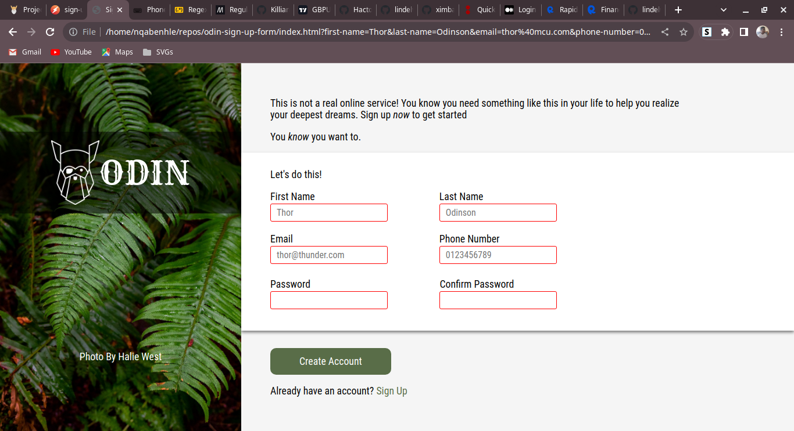

# Sign up form

This is a simple sign-up form UI that has client-side form validation.

## [Live Preview](https://lindelwa122.github.io/odin-sign-up-form/)



## How it works

### Styling

Forms are styled based on their state. Here are the input states and their styling:

* Invalid State.
    
    Each input field has constraints and they also share the **required** constraint. So by default, every input field will be invalid because it will start as empty.

    The border is changed to red when the input field is invalid:

    ```css
    input:invalid {
        border-color: rgb(255, 0, 0);
    }
    ```

* Focus State

    When a user is filling an input field a box shadow will be added and the border color is changed to blue.

    ```css
    input:focus {
        border-color: rgb(65, 105, 225);
        box-shadow: 1px 2px 4px rgba(65, 105, 225, 0.5);
    }
    ```

    Note that if the input field state is invalid, the blue color will be overridden by the red color.

### Custom Validity Message

For the most part, the browser's default messages do the job very well of describing what's wrong to the user but with the phone number, I felt the default needs to be changed a little bit. Here's how I changed it:

```javascript

phoneNumber.addEventListener("input", () => {
  if (phoneNumber.validity.patternMismatch) {
    phoneNumber.setCustomValidity("Ensure your number is correct and formatted correctly.");
  } else {
    phoneNumber.setCustomValidity("");
  }
});

```

### Helper

For a good user experience, I help the user fill in the form with the right information using the right format. By default, helpers are hidden (or technically have a height of 0). I have a function called ```toggleVisibility()``` that shows a helper for a field if its state is ```focus``` and hides if the state changes to ```blur```.

```javascript
const toggleVisibility = (selector, action="show") => {
  const element = document.querySelector(selector);

  switch (action) {
    case "show":
      element.style.height = element.scrollHeight + "px";
      break;

    case "hide":
      element.style.height = 0;
      break;
  }
}

// Example of toggleVisibitity() in use
phoneNumber.addEventListener("focus", () => {
  toggleVisibility("#phone-number + .helper");
});

phoneNumber.addEventListener("blur", () => {
  toggleVisibility("#phone-number + .helper", "hide");
});
```

## Credits

* This [project](https://www.theodinproject.com/lessons/node-path-intermediate-html-and-css-sign-up-form) is part of the [Odin Project's curriculum](https://www.theodinproject.com).
* The logo used belongs to the Odin Project and I have permission to use it.
* The background image is taken from [Unsplash](https://unsplash.com) and the artist is [Halie West](https://unsplash.com/@haliewestphoto).

## Conclusion

Feel free to fork my repo and use this signup form in your projects, but just remember to remove the Odin Project's logo and credit the artist, Halie West, if you are going to use his image.

Thank you. Happy Coding! :)
